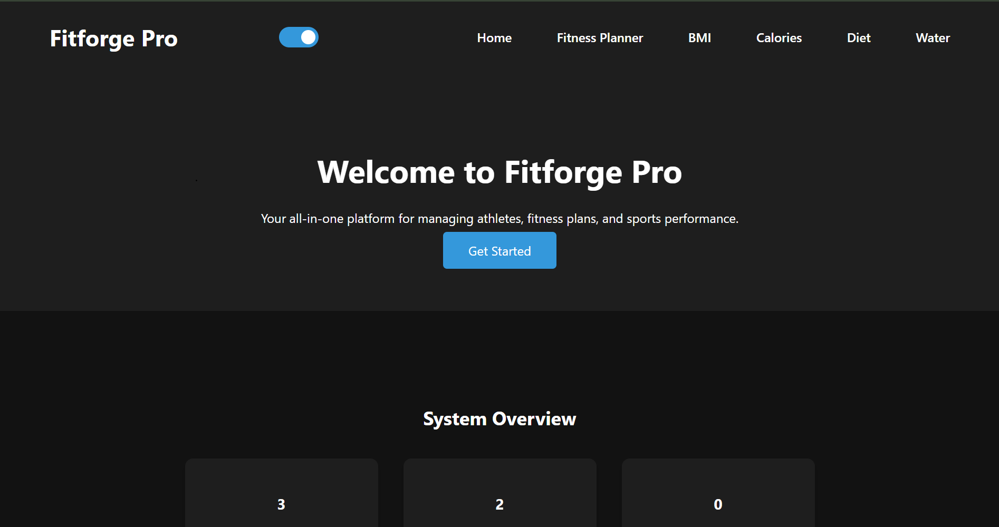
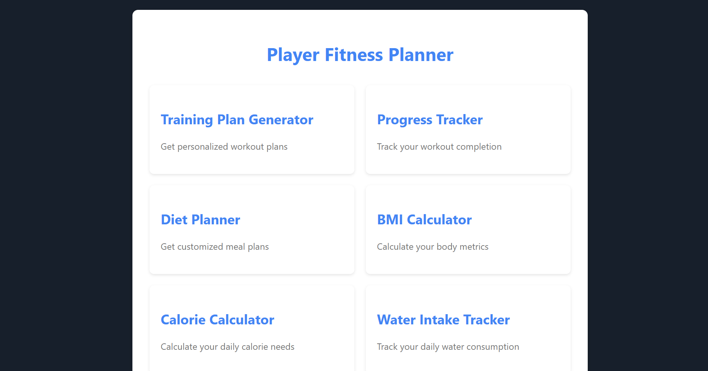
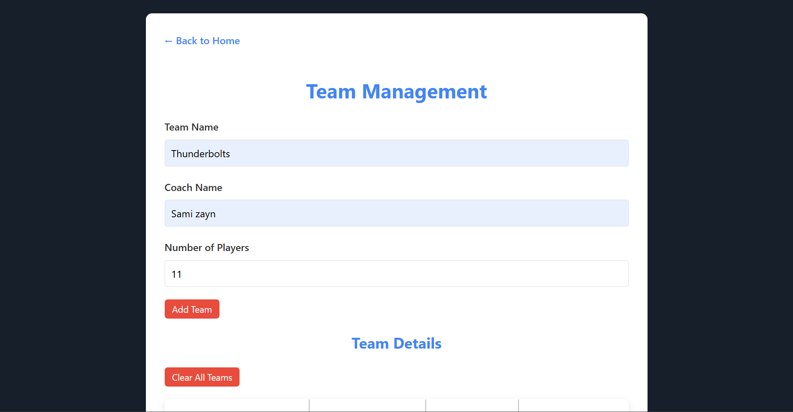

#  FitForge Pro

FitForge Pro is a Sports and Fitness Management System built using Node.js, Express.js, HTML, CSS, and JavaScript.  
It provides a simple platform to manage teams, schedule matches, and track athlete performance and fitness metrics.

##  Features

• Team Management System  
• Match Scheduling  
• Player Performance Tracking  
• BMI Calculator  
• Calorie Calculator  
• Water Intake Tracker  
• Clean and Responsive UI  

##  Tech Stack

Backend  
• Node.js  
• Express.js  

Frontend  
• HTML5  
• CSS3  
• JavaScript  

Tools  
• Git  
• GitHub  
• VS Code  

---

##  Project Structure

FITFORGE-PRO  
│  
├── fitness  
│   ├── css  
│   ├── html  
│   └── js  
│  
├── server.js  
├── package.json  
├── package-lock.json  
├── README.md  
└── .gitignore  

---

##  Installation

Clone the repository

git clone https://github.com/Alexy-ak06/FITFORGE-PRO.git

Navigate into the project

cd FITFORGE-PRO

Install dependencies

npm install

Run the application

node server.js

---

##  Future Improvements

• User authentication system  
• Database integration  
• Dashboard analytics  
• Mobile responsiveness improvements  

---

##  Purpose

This project was developed as a learning and portfolio project to demonstrate full-stack web development skills using the Node.js ecosystem.

---

##  Credits

Developed and customized by
Ayush Kumar Mahapatra  

GitHub  
https://github.com/Alexy-ak06

### Homepage

### Dashboard

### Team Management
